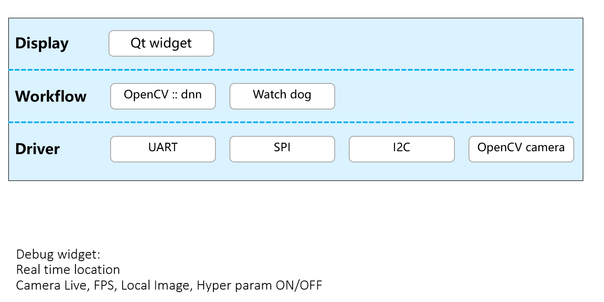
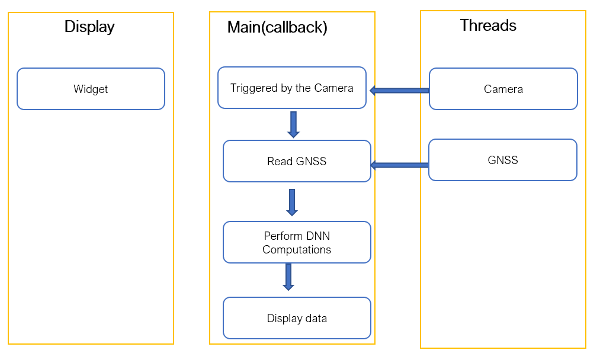

# 
Roads Damages Detector

   

open source? 
license?
click to ins https://www.instagram.com/haodongll/?igshid=YmMyMTA2M2Y=
click to youtube https://www.youtube.com/@roadsdamagesdetectorhaodongll
auto unit test?
demo(linux)?
## 1. Project Overview
The Roads Damages Detector project aims to develop a mobile application that uses roads damages detection technology to detect and classify road damages such as potholes, cracks, and other issues in real-time. The application will be designed to be efficient and user-friendly, helping road maintenance crews to identify and repair road damages more quickly. The detection algorithm will be deployed on a Raspberry Pi and operate in real-time, with the location of each damage recorded via a GNSS module and a report generated after each detection mission.

## 2. Backgrounds
There are five types of roads damages: alligator cracks, linear cracks, pothole, white road blur and road rut. The repair methods and task urgency of these roads damages are different, it is necessary to do investigations before taking action.

## 3. Team Organization

|Name|ID|Role|
|---|---|---|
|Kaiwen DONG|2749039D|C++ Engineer|
|Wenjia HAO|2729835H|Software Engineer|
|Yang LIU|2749545L|UI & Marketing Designer|
|Yujie LIU|2544989lL|Engineering Assistant|
### Kaiwen DONG:
1. Designing and implementing algorithms and data structures in C++ to integrate automated road damage detection technology into the Raspberry Pi platform.
2. Developing and maintaining code libraries with a focus on code quality and readability.
3. Collaborating closely with other team members, especially software developers and quality assurance experts, to ensure smooth project progress.
4. Assisting the testing team with system testing to ensure that the detection algorithm performs accurately in various scenarios.
5. Analyzing and solving technical issues that arise during the project, working with other team members to develop and implement solutions.

Overall, the C++ engineer's role is to ensure that the C++ algorithms and data structures used in the project are accurately integrated into the Raspberry Pi platform and to collaborate with other team members to ensure the project progresses according to plan.

### Wenjia HAO:
1. Training different model such as Yolov3, Yolov5, Yolov5_lite and compare their performance to find best one.
2. Integrating the YOLOv5_lite model into the application and integrating it with other modules such as the image acquisition module.
3. Conducting model training and testing using existing datasets or generating their own datasets by collecting and labeling data.
4. Collaborating with other team members such as the C++ engineer, testing engineer, and project manager to ensure smooth project progress.
5. Continuously improving and optimizing the road damage detection application to enhance the accuracy and efficiency of the detection.

In summary, the software engineer responsible would be responsible for integrating and optimizing the YOLOv5 model, conducting model training and testing, ensuring the smooth integration and collaboration of the model with the application, and continuously improving and optimizing the road damage detection application to enhance the accuracy and efficiency of detection.

### Yang LIU:
1. Develop the user interface design for the product based on the product manager's product plan and functionality requirements.
2. Continuously optimize the product interface design and user interaction process based on user research and feedback to improve user experience.
3. Work closely with the development team to ensure the product interface design can be accurately implemented.
4. Design marketing copy and creative materials, produce marketing materials and promotional videos to increase product awareness and user attraction.

### Yujie LIU:
1. Prepare the project plan, follow up the task progress according to the project plan.
2. Assist engineers with daily tasks and project management, such as scheduling meetings, taking meeting notes, and tracking task progress.
3. Collect and organize project information and technical documents to help engineers better understand project background and technical details.
4. Assist engineers in technical research and experimentation, such as writing code, running tests, and writing technical documentation.

## 4. Architecture（driver 待确认）

### Hardware: 
#### 1) Raspberry

Raspberry Pi is a series of small single-board computers (SBCs).

  

##### Raspberry Pi for Real Time Embedded Programming
Raspberry Pi can be used for real-time embedded programming as it has the capability to handle real-time applications with its powerful processor and various I/O ports.

##### Function of Raspberry Pi for Real-time Embedded Programming

Control: Raspberry Pi can be used to control various electronic devices and systems, including robotics, automation, and IoT devices.

Data processing: Raspberry Pi can acquire, process and analyze data in real-time, making it useful for applications that require real-time data processing. With its Input/Output ports, it can interface with a wide range of sensors and actuators, enabling the collection of data and control of hardware in real-time;

Programming languages: Raspberry Pi can be used to develop and test real-time applications using a variety of programming languages, including Python, C, and C++;

Communication: Raspberry Pi can be used to communicate with other devices and systems.

##### I/O ports of Raspberry Pi:
I/O ports can be interface with external devices and sensors. These ports can be used for various real-time applications, such as robotics, automation, and control systems.

UART. Universal Asynchronous Receiver-Transmitter;

GPIO. General Purpose Input/Output;

SPI. Serial Peripheral Interface;

I2C. Inter-Integrated Circuit.

##### Value of Raspberry Pi:
Raspberry Pi can be a effective solution for real-time embedded programming, and it requires proper configuration and software development skills to ensure the system operates in real-time with the required accuracy and precision.

#### 2) Pi Camera
---Raspberry Pi v2.1 8 MP 1080p Camera Module

Memory storage capacity: 12 GB

Wireless Type:	Infrared

Second Generation Raspberry Pi Camera Module with Fixed Focus Lens

Sony Exmor IMX219 Sensor Capable of 4K30 1080P60 720P180 8MP Still

3280 (H) x 2464 (V) Active Pixel Count

Maximum of 1080P30 and 8MP Stills in Raspberry Pi Board

More information: https://www.amazon.co.uk/Raspberry-Pi-1080p-Camera-Module/dp/B01ER2SKFS

#### 3) GPS Module Receiver
---GPS Module Receiver,Navigation Satellite Positioning NEO-6M (Arduino GPS, Drone Microcontroller, GPS Receiver) Compatible with 51 Microcontroller STM32 Arduino UNO R3 with Antenna High Sensitivity

High Sensitivity:The GPS module uses the original 7th generation chip and the software is compatible with NEO-6M. The GT-U7 module features high sensitivity, low power consumption, and miniaturization. Its extremely high tracking sensitivity greatly expands its coverage.

Features:With a USB interface, you can directly use the phone data cable on the computer point of view positioning effect; With IPEX antenna interface, the default distribution of active antenna, can be quickly &high-precision positioned.

Application:Vehicle-mounted, handheld devices such as PDAs, Vehicle-monitoring, Mobile phones, camcorders and other mobile positioning systems, Sharing bike, Sharing mobile power.

Note: This GPS module will not search for signals when the weather is bad, and it will not search for stars indoors. When using it, please make sure that the GPS module is in an open location.

More information: https://www.amazon.co.uk/Navigation-Positioning-Microcontroller-Compatible-Sensitivity/dp/B08XGN4YLY/ref=sr_1_3?crid=2KXS44IICOL34&keywords=Quectel+gps&qid=1674314365&s=electronics&sprefix=quectel+gps%2Celectronics%2C72&sr=1-3

### Software: 

### Input: 
1. Camera video stream
2. GPS coordinates
3. Deep learning model
4. Deep learning model weights
5. Deep learning classification table
6. Image preprocessing parameters 

### Output: 
During detection, real-time display of images with identified boxes is available; detection results such as type, confidence score, size, etc. can be displayed; logs can also be displayed. 
Additional features:
1. Support for traditional image preprocessing
2. Display of maps with GPS coordinates
3. Ability to recognize other objects

Final output presentation (QT): Page design + coding

## 5. How to Build
### Prerequisites
Make sure the following software is installed on your system:

C++ compiler

CMake (version 3.10 or higher)

Make (Linux and macOS) or Visual Studio (Windows)

### Build instructions
#### 1) Refer to the link to install ncnn:

https://github.com/Tencent/ncnn

#### 2) Clone the project repository:

git clone https://github.com/your-username/your-project.git

#### 3) Navigate to the project directory:

cd your-project

#### 4) Create a build directory:

mkdir build

#### 5) Navigate to the build directory:

cd build

#### 6) Generate build files using CMake:

cmake ..

Note: You can specify additional options to CMake as needed.

#### 7) Build the project using Make (on Linux and macOS):

make

Or build the project using Visual Studio (on Windows):

Open the project solution in Visual Studio and build it.

#### 8) Use the system's package manager to install these libraries:

--qtdedavative5-dev: contains the QML modules for Qt 5, which can be used to develop Qt Quick-based applications. 

--qtquickcontrols2-5-dev: contains the Qt Quick Controls 2 module, which provides a set of reusable UI controls. 

--libopenCV-dev: is the development files of the OpenCV computer vision library, providing the header files and library files needed for compilation and linking. 

For example, on Ubuntu, install these libraries using the following command:

sudo apt-get install qml-module-qtquick2 qml-module-qtquick-controls2 libopencv-dev

#### 9) Run the project:

./your-project

Note: This assumes that the project generates an executable named "your-project". If your project generates a different executable name, replace "your-project" with the correct name.

## 6. Documents
### Technical Documents:
Product Requirements Document:
https://github.com/KW-DONG/Roads-Damages-Detector/blob/develop_qml/doc/Product%20Requirements%20Document.md

C++程序设计（UML图）?\部署、发布（到main）、Cmake 交叉编译--kaiwen

yolov5 training process: 
https://github.com/KW-DONG/Roads-Damages-Detector/tree/yolo_training/yolo_training/yolov5#readme.md

yolov5_lite training process:
https://github.com/KW-DONG/Roads-Damages-Detector/tree/yolo_training/yolo_training/YOLOv5-Lite-master#readme.md

yolo training compare and test:
https://github.com/KW-DONG/Roads-Damages-Detector/blob/yolo_training/yolo_training/readme.md

单元测试:？

Test Case & Report:
https://github.com/KW-DONG/Roads-Damages-Detector/blob/develop_qml/doc/Test%20Report.md)

### Management File
Plan: ?(缺凯文)--yujie-->更新会议纪要

Process Management:
https://github.com/KW-DONG/Roads-Damages-Detector/blob/develop_qml/doc/process/Process%20Management.md

### Promotion of the Work:
https://github.com/KW-DONG/Roads-Damages-Detector/blob/develop_qml/doc/Promotion%20of%20the%20Work.md
