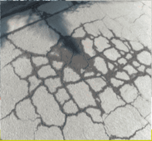
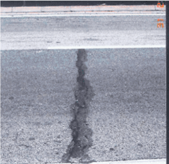
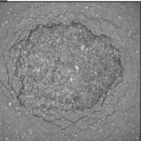
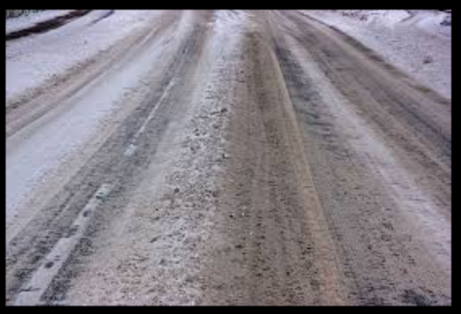
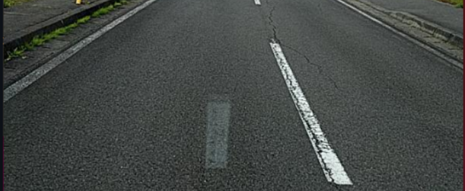
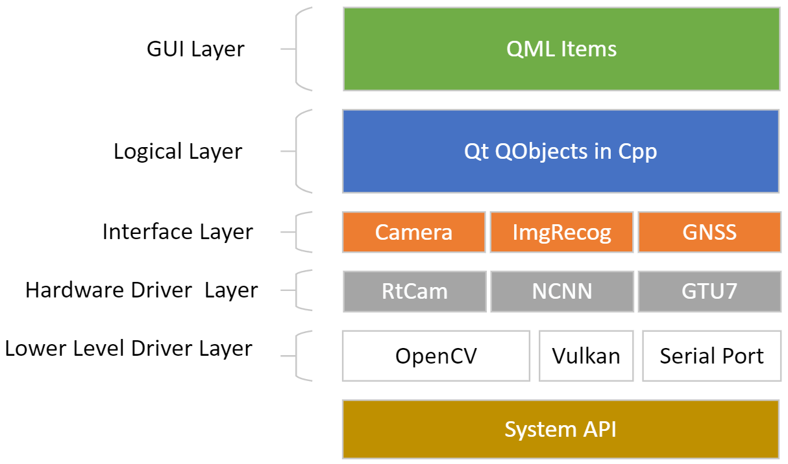
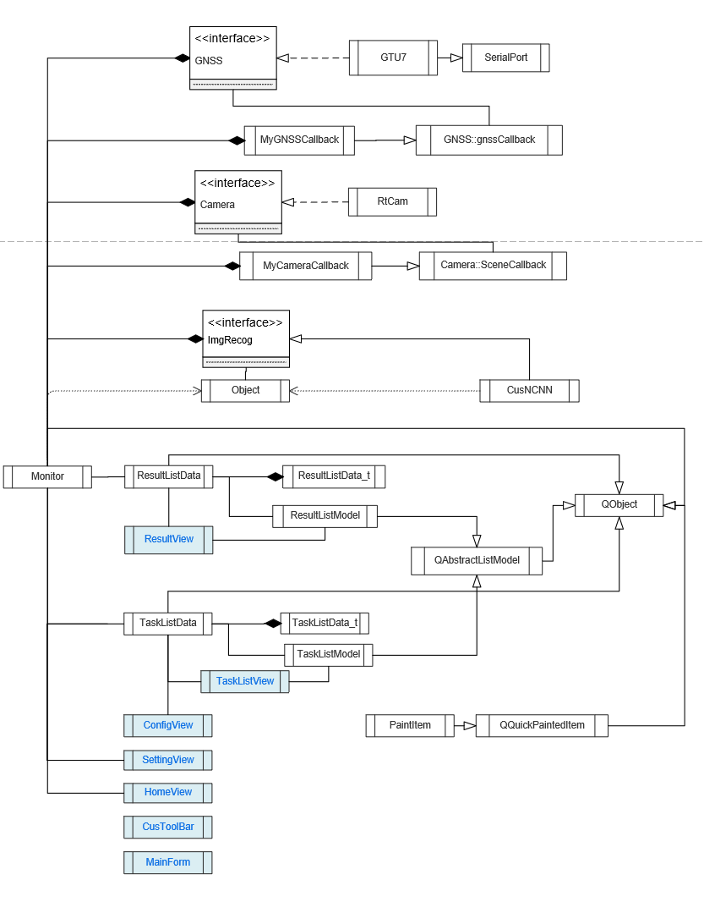
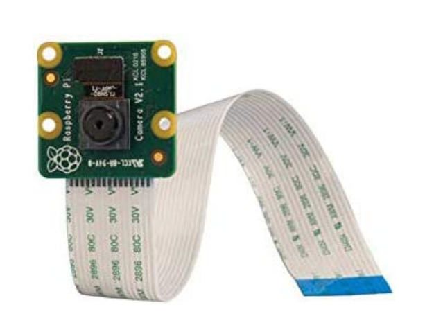
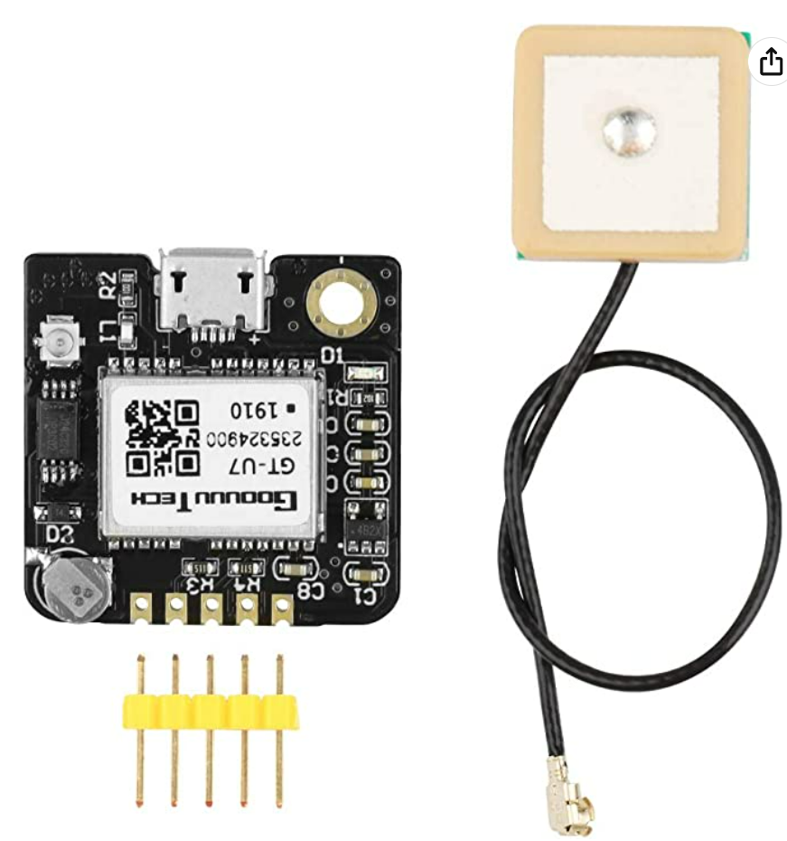

# <div align=center>Roads Damages Detector</div>
<div align=center></div>

<div align=center></div>

<div align=center>   </div>

## Following us !🚀🚀

🎞️[click to Ins](https://www.instagram.com/haodongll/?igshid=YmMyMTA2M2Y=)

🎥[click to youtube](https://www.youtube.com/@roadsdamagesdetectorhaodongll)

📻[click to BiliBili](https://www.bilibili.com/video/BV1fM41157bw/?vd_source=9fa995d1b84843dbd0a37825e1aefcab)

👓[click to Tiktok](https://www.douyin.com/user/self?modal_id=7222734212317629734)
## Auto Unit test

|Source|State|
|---|---|
|test_camera||
|test_gtu7(gps module)||
|test_listdtata||
|test_serial||
|test_ncnn||
## Demo
### indoor demo on raspberry Pi
[](https://github.com/KW-DONG/Roads-Damages-Detector/blob/develop_qml/images/demotest.gif)
### outdoor demo on Linux to test GPS
[.gif)](https://github.com/KW-DONG/Roads-Damages-Detector/blob/develop_qml/images/outdoordemotest%20(2).gif)
## 1. Project Overview
The Roads Damages Detector project aims to develop a mobile application that uses roads damages detection technology to detect and classify road damages such as potholes, cracks, and other issues in real-time. The application will be designed to be efficient and user-friendly, helping road maintenance crews to identify and repair road damages more quickly. The detection algorithm will be deployed on a Raspberry Pi and operate in real-time, with the location of each damage recorded via a GNSS module and a report generated after each detection mission.

## 2. Backgrounds
There are five types of roads damages: alligator cracks, linear cracks, pothole, white road blur and road rut. The repair methods and task urgency of these roads damages are different, it is necessary to do investigations before taking action.

<div align="left">





</div>

## 3. Team Organization

|Name|ID|Role|
|---|---|---|
|Kaiwen DONG|2749039D|C++ Engineer|
|Wenjia HAO|2729835H|Software Engineer|
|Yang LIU|2749545L|UI & Marketing Designer|
|Yujie LIU|2544989lL|Engineering Assistant|
### Kaiwen DONG:
1. Designing and implementing algorithms and data structures in C++ to integrate automated road damage detection technology into the Raspberry Pi platform.
2. Developing and maintaining code libraries with a focus on code quality and readability.
3. Collaborating closely with other team members, especially software developers and quality assurance experts, to ensure smooth project progress.
4. Assisting the testing team with system testing to ensure that the detection algorithm performs accurately in various scenarios.
5. Analyzing and solving technical issues that arise during the project, working with other team members to develop and implement solutions.

Overall, the C++ engineer's role is to ensure that the C++ algorithms and data structures used in the project are accurately integrated into the Raspberry Pi platform and to collaborate with other team members to ensure the project progresses according to plan.

### Wenjia HAO:
1. Training different model such as Yolov3, Yolov5, Yolov5_lite and compare their performance to find best one.
2. Integrating the YOLOv5_lite model into the application and integrating it with other modules such as the image acquisition module.
3. Conducting model training and testing using existing datasets or generating their own datasets by collecting and labeling data.
4. Collaborating with other team members such as the C++ engineer, testing engineer, and project manager to ensure smooth project progress.
5. Continuously improving and optimizing the road damage detection application to enhance the accuracy and efficiency of the detection.

In summary, the software engineer responsible would be responsible for integrating and optimizing the YOLOv5 model, conducting model training and testing, ensuring the smooth integration and collaboration of the model with the application, and continuously improving and optimizing the road damage detection application to enhance the accuracy and efficiency of detection.

### Yang LIU:
1. Develop the user interface design for the product based on the product manager's product plan and functionality requirements.
2. Continuously optimize the product interface design and user interaction process based on user research and feedback to improve user experience.
3. Work closely with the development team to ensure the product interface design can be accurately implemented.
4. Design marketing copy and creative materials, produce marketing materials and promotional videos to increase product awareness and user attraction.

### Yujie LIU:
1. Prepare the project plan, follow up the task progress according to the project plan.
2. Assist engineers with daily tasks and project management, such as scheduling meetings, taking meeting notes, and tracking task progress.
3. Collect and organize project information and technical documents to help engineers better understand project background and technical details.
4. Assist engineers in technical research and experimentation, such as writing code, running tests, and writing technical documentation.

## 4. Architecture
### Software Architecture
<div align="left">

</div>

|Layer|-|Comments|
|---|---|---|
|QML GUI Layer|-|Provide graphical user interface in QML, and use javascript calling cpp classes
|Cpp Logical Layer|-|Inherited from QObjects, can communicate with qml items|
|Interface Layer|-|Virtual classes that called by logical layer|
|Hardware Driver Layer|-|Inherited from interface classes, implementation of specific hardware or algorithm module|
|Lower Level Driver Layer|-|Existing libraries or drivers that directly call the system api|

### System Inputs: 
1. Camera video stream
2. GPS coordinates
3. Deep learning model
4. Deep learning model weights
5. Image preprocessing parameters 

### System Output: 
During detection, real-time display of images with identified boxes is available; detection results such as type, confidence score, size, etc. can be displayed; logs can also be displayed. 
Additional features:
1. Support for traditional image preprocessing
2. Display of maps with GPS coordinates
3. Ability to recognize other objects

### UML
<div align="left">

</div>

### Hardware
#### 1) Raspberry

Raspberry Pi is a series of small single-board computers (SBCs).
<div align="left">


  
</div>

##### Raspberry Pi for Real Time Embedded Programming
Raspberry Pi can be used for real-time embedded programming as it has the capability to handle real-time applications with its powerful processor and various I/O ports.

##### Function of Raspberry Pi for Real-time Embedded Programming

Control: Raspberry Pi can be used to control various electronic devices and systems, including robotics, automation, and IoT devices.

Data processing: Raspberry Pi can acquire, process and analyze data in real-time, making it useful for applications that require real-time data processing. With its Input/Output ports, it can interface with a wide range of sensors and actuators, enabling the collection of data and control of hardware in real-time;

Programming languages: Raspberry Pi can be used to develop and test real-time applications using a variety of programming languages, including Python, C, and C++; In this project the main language utilized is C++.

Communication: Raspberry Pi can be used to communicate with other devices and systems. In this project we communicate with GNSS module and camera module.

##### I/O ports of Raspberry Pi:
I/O ports can be interface with external devices and sensors. These ports can be used for various real-time applications, such as robotics, automation, and control systems.

UART. Universal Asynchronous Receiver-Transmitter; In this project, we utilize UART to communicate with GNSS module.

GPIO. General Purpose Input/Output;

SPI. Serial Peripheral Interface;

I2C. Inter-Integrated Circuit.

##### Value of Raspberry Pi:
Raspberry Pi can be a effective solution for real-time embedded programming, and it requires proper configuration and software development skills to ensure the system operates in real-time with the required accuracy and precision.

#### 2) Pi Camera
---Raspberry Pi v2.1 8 MP 1080p Camera Module
<div align="left">

</div>
Memory storage capacity: 12 GB

Wireless Type:	Infrared

Second Generation Raspberry Pi Camera Module with Fixed Focus Lens

Sony Exmor IMX219 Sensor Capable of 4K30 1080P60 720P180 8MP Still

3280 (H) x 2464 (V) Active Pixel Count

Maximum of 1080P30 and 8MP Stills in Raspberry Pi Board

More information: https://www.amazon.co.uk/Raspberry-Pi-1080p-Camera-Module/dp/B01ER2SKFS

#### 3) GPS Module Receiver
---GPS Module Receiver,Navigation Satellite Positioning NEO-6M (Arduino GPS, Drone Microcontroller, GPS Receiver) Compatible with 51 Microcontroller STM32 Arduino UNO R3 with Antenna High Sensitivity
<div align="left">

</div>
High Sensitivity:The GPS module uses the original 7th generation chip and the software is compatible with NEO-6M. The GT-U7 module features high sensitivity, low power consumption, and miniaturization. Its extremely high tracking sensitivity greatly expands its coverage.

Features:With a USB interface, you can directly use the phone data cable on the computer point of view positioning effect; With IPEX antenna interface, the default distribution of active antenna, can be quickly &high-precision positioned.

Application:Vehicle-mounted, handheld devices such as PDAs, Vehicle-monitoring, Mobile phones, camcorders and other mobile positioning systems, Sharing bike, Sharing mobile power.

Note: This GPS module will not search for signals when the weather is bad, and it will not search for stars indoors. When using it, please make sure that the GPS module is in an open location.

More information: https://www.amazon.co.uk/Navigation-Positioning-Microcontroller-Compatible-Sensitivity/dp/B08XGN4YLY/ref=sr_1_3?crid=2KXS44IICOL34&keywords=Quectel+gps&qid=1674314365&s=electronics&sprefix=quectel+gps%2Celectronics%2C72&sr=1-3

## 5. How to Build
### Build for Ubuntu and Raspberry Pi
Install basic packages
```
sudo apt update
sudo apt upgrade
sudo apt install vim gcc g++ git make
```
Clone the repository:
```
git clone https://github.com/KW-DONG/Roads-Damages-Detector.git
```
Install develop libraries:
```
sudo apt install qt5-default qtbase5-dev qtdeclarative5-dev qtquickcontrols2-5-dev libqt5serialport5-dev libopencv-dev libgtest-dev
```
Download and build NCNN library from https://github.com/Tencent/ncnn. 
Make sure you have generated the `install` folder by executing `make install`.
Generally, the `install` contains three folders: `bin`, `include` and `lib`

Register the `lib/cmake/ncnn` folder which contains ncnnConfig.cmake to `/etc/profile`
```
sudo vim /etc/profile
```
Add the following to the bottom and reboot
```
export ncnn_DIR="<your folder that contains ncnnConfig.cmake>"
```
Build the project:
```
cd Roads-Damages-Detector
mkdir build
cd build
cmake ../
make
```
Install runtime libraries:
```
sudo apt install qml-module-qtquick-dialogs qml-module-qtquick-controls2 qml-module-qtquick-controls qml-module-qt-labs-folderlistmodel qml-module-qt-labs-settings qml-module-qtquick-layouts
```
Run
```
cd build_SmartCam
sudo ./SmartCam
```
### Build for Windows using Visual Studio 2022

Download and install Visual Studio 2022 community from https://visualstudio.microsoft.com/vs/community/

Install Qt from https://www.qt.io/

You can download the qt online installer from the official website and the Qt version supported is from 5.10 to 5.15

Install cmake from https://cmake.org/

Download and extract OpenCV from https://opencv.org/

Find the folder that contains OpenCVConfig.cmake such as `opencv/build/x64/vc16/lib` and register it as environment variable `OpenCV_DIR`

Download and build NCNN from https://github.com/Tencent/ncnn

Find the folder that contains ncnnConfig.cmake and register it as environment variable `ncnn_DIR`.

Create a folder for storing compiled files and run CMake GUI select the project root folder as source. By clicking configuration and generation a visual studio solution file `.sln` will be generated. Double click the solution file and compile the project with visual studio.

Run Qt console for example "Qt 5.15.2 (MSVC 2019 64-bit)" and switch to the folder that contains `SmartCam.exe`

Deploy the project with windeployqt:
```
windeployqt SmartCam.exe --qmldir <your qml path such as "Qt\5.15.2\msvc2019_64\qml">
```
Double click `SmartCam.exe`

## 6. Documents
[Product Requirements Document](
https://github.com/KW-DONG/Roads-Damages-Detector/blob/develop_qml/doc/Product%20Requirements%20Document.md)

[Yolov5 Training Process]( 
https://github.com/KW-DONG/Roads-Damages-Detector/tree/yolo_training/yolo_training/yolov5#readme.md)

[Yolov5_lite Training Process](
https://github.com/KW-DONG/Roads-Damages-Detector/tree/yolo_training/yolo_training/YOLOv5-Lite-master#readme.md)

[Yolo training compare and test](
https://github.com/KW-DONG/Roads-Damages-Detector/blob/yolo_training/yolo_training/readme.md)

[Test Case & Report](
https://github.com/KW-DONG/Roads-Damages-Detector/blob/develop_qml/doc/Test%20Report.md)

[Project Plan](
https://github.com/KW-DONG/Roads-Damages-Detector/blob/develop_qml/doc/process/Plan.xlsx)

[Process Management](
https://github.com/KW-DONG/Roads-Damages-Detector/blob/develop_qml/doc/process/Process%20Management.md)

[Promotion of the Work](
https://github.com/KW-DONG/Roads-Damages-Detector/blob/develop_qml/doc/Promotion%20of%20the%20Work.md)
