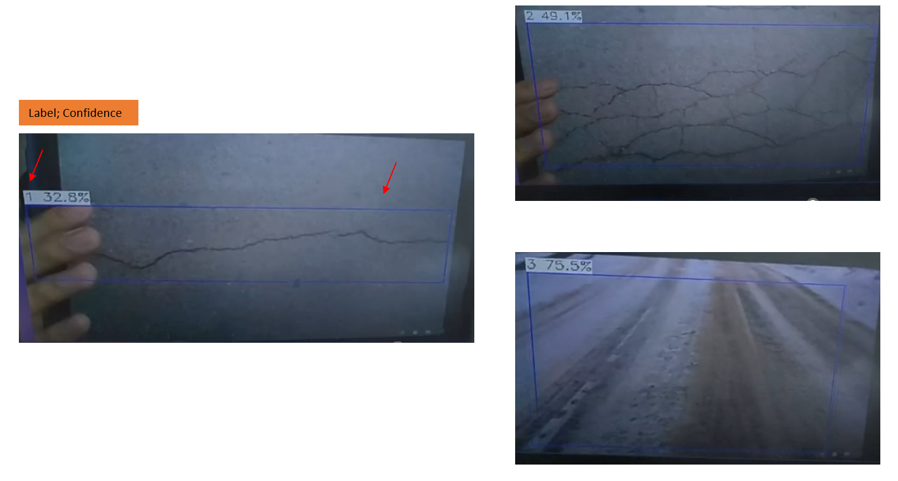

## Test Report
## 1. Test Case
|Test Case ID|Test Case Description|Expected Result|Test Result|
|---|---|---|---|
|TC001|	Create new task: Click "+Add Task" and add a task with name "Undefined0". Click "+Add Task" again and add a task with name "Undefined1".	|Two new tasks with names "Undefined0" and "Undefined1" should be added to the "Task List". 	|Pass|
|TC002|	Modify task: Change the "Title", select options from dropdown menus, select "Model Path" and "Weight Path", and input "Confidence" and "Threshold".	|The modified task information should be automatically saved.	|Pass|
|TC003|	Delete task: Click the delete button next to the name of the task to be deleted in the "Task List".	|The task should be deleted from the "Task List".	|Pass|
|TC004|	Execute task: Select a task from the "Task List" dropdown menu, click "Start" to begin detection, and check the results displayed in "Result".	|The camera interface should display and the results should be displayed in the "Result" section. 	|Pass|
|TC005|	Stop task: Click "Stop" to stop the execution of a task.	|The task should stop.	 |Pass|
|TC006|	Display results: Check the images and data saved in the "result" folder and "Result" section.	|Images and data should be saved in the "result" folder and displayed in the "Result" section.	 |Pass|
|TC007|	Delete result page: Delete the corresponding image folder or image in the "result" folder and check "Result List" in "Result" section.	|The deleted image should no longer be displayed in "Result List".	|Pass|
|TC008|	Setting page: Click "Setting" and configure device settings such as "Autostart on Power On", "Tasks to Auto-start", "Camera Resolution", and "GPS Communication Mode".	|The device settings should be configured as specified.	|Pass|
|TC009|	Setting page: Click "Setting" and configure device settings such as "External Trigger" and "Signal Output".	|The device settings should be configured as specified.	|Pass|

Test Result Images:

1. TC001-Create new task

2. TC004-Execute task

3. TC006-Display results
（GPS 结果待上传照片）

 

4. TC008,TC009-Setting page

## 2. Testing Report Summary
This testing report summarizes the functional testing of a road surface detection device, which includes eight aspects: creating tasks, setting task content, deleting tasks, executing tasks, stopping tasks, displaying results, deleting result pages, and setting pages. During the testing, we followed the testing steps provided in the testing case table to evaluate the device's functionality.

Overall, the device performed well in creating tasks, setting task content, deleting tasks, executing tasks, stopping tasks, displaying results, and deleting result pages. The device accurately identified road defects and saved defect information and related GPS information to a .csv file for data analysis and processing. The device also performed as expected in stopping tasks, displaying results, and deleting result pages.

In conclusion, based on the testing results, the road surface detection device has good functionality and can meet users' needs for road defect detection. However, further testing and evaluation are required to assess the device's stability, accuracy, and overall performance to enhance user satisfaction.
